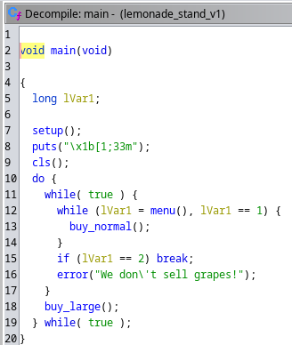

# Lemonade Stand v1 

This challenge is an basic ret2win attack.

## Basic file checks

We see that the RELRO is full enabled so can't write anything in the GOT table to perform a "GOT overwrite" attack. \
The NX is also enabled, so that means we can't stored input or data cannot be executed as code to perform a shellcode attack.

## View the Source Code

We used Ghidra to disassemble the binary.\
The first thing that we want to do is to go to Functions section and select the main() to see\
what the binary is actually doing and what funtions are called.\
\

We saw that the main is calling two funcrions buy_normal()" and buy_large().\
We navigate to them and we saw that both of them they calling a save_creds() func.\
\

