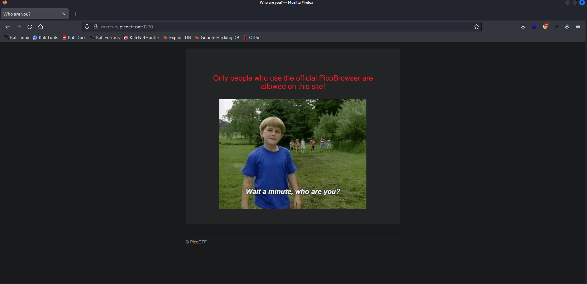
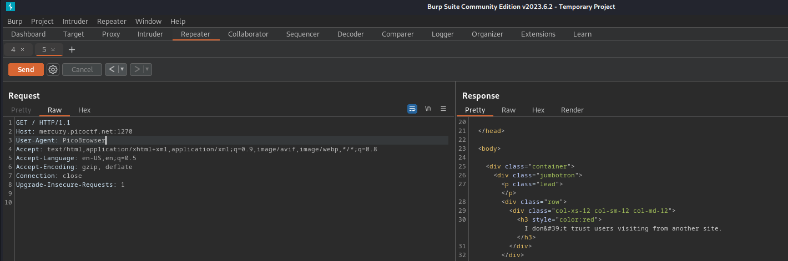
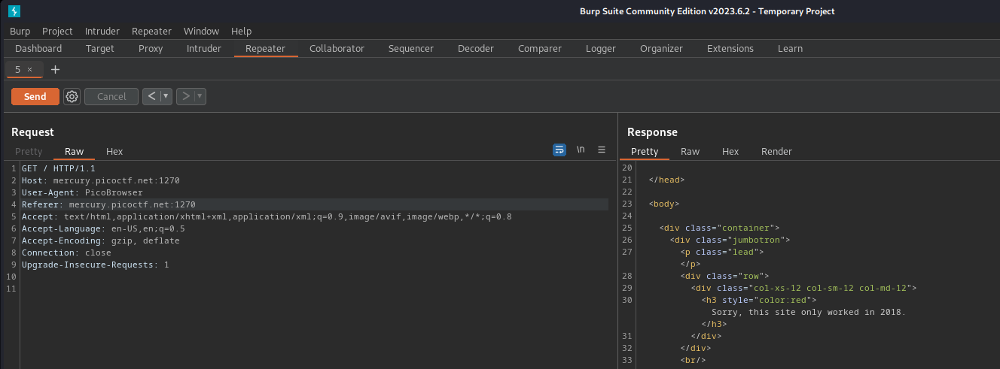
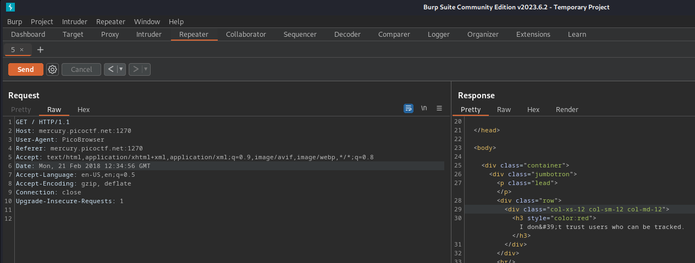
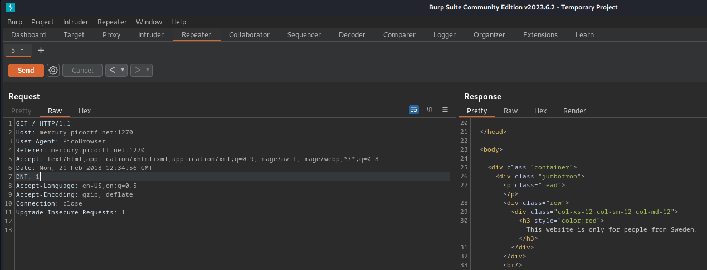
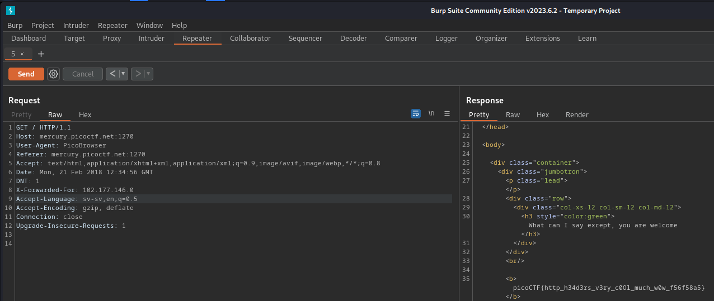
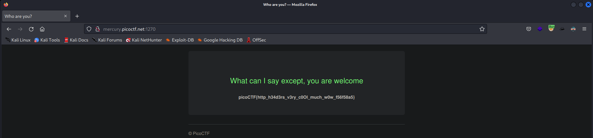

# Writeup for: web_Who_are_you?

This is an easy web explotation challenge

## First look at the site's page


We see that it wants to use the "official PicoBrowser", so will use Burp Suite to modiy the User-Agent to: 
  ```http
  User-Agent: PicoBrowser
```

- Then, it needed information from pico's site, with a little search we found that we can add add the Referer header
to do it for us
 ```http
 Referer: mercury.picoctf.net:1270
 ```
 

- Next, it mentioned that the site only worked from 2018 and earlier, so how will do this???
  Again the same thing, searching and searching...
  So we added the Date header
```http
    Date: Mon, 21 Feb 2018 12:34:56 GMT
  ```
  

- Following that, it expressed distrust, so we included DNT (Do Not Track header): 
  ```http
    DNT: 1
  ```
  

- Subsequently, it stated that it only accepts requests from Sweden. We searched on Google to find some public Swedish IPs and added the X-Forwarded-For header, to achieve this 
  ```http
    X-Forwarded-For: 102.177.146.0
  ```
  

- Lastly, it noted that we are in Sweden but don't speak Swedish, so we changed the Accept-Language to: 
  ```htpp
    Accept-Language: sv-sv,en;q=0.5
  ```

And finally, we obtained the flag! :)



